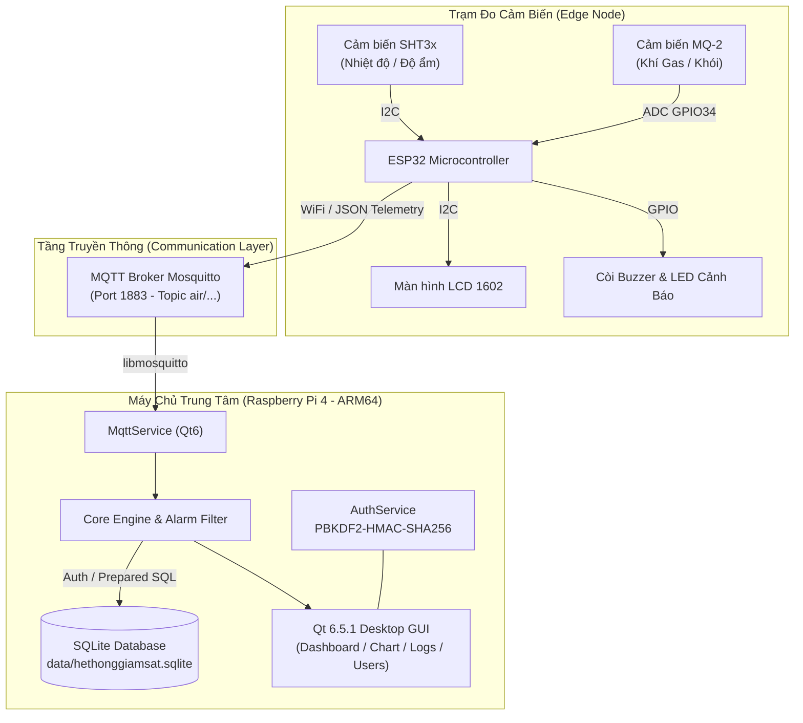

<div align="center">

# 🌿 HỆ THỐNG GIÁM SÁT CHẤT LƯỢNG KHÔNG KHÍ & CẢNH BÁO KHÍ GAS
### Real-Time Air Quality & Gas Monitoring System

[](https://github.com/blynkapp04-ui/Hethonggiamsat/actions/workflows/ci.yml)
[](https://github.com/blynkapp04-ui/Hethonggiamsat/releases)
[](LICENSE)
[](https://en.cppreference.com/w/cpp/17)
[](https://www.qt.io/)
[](https://www.raspberrypi.com/)
[](https://mosquitto.org/)
[](https://www.sqlite.org/)

<p align="center">
  <b>Hệ thống giám sát chất lượng không khí, nhiệt độ, độ ẩm và nồng độ khí gas công nghiệp thời gian thực</b><br>
  Tích hợp trạm đo biên ESP32, truyền thông bảo mật MQTT Mosquitto, máy chủ trung tâm Raspberry Pi 4 chạy ứng dụng Qt 6 GUI hiện đại và cơ sở dữ liệu SQLite3.
</p>

[Tính Năng](#-tính-năng-nổi-bật) •
[Kiến Trúc](#-kiến-trúc-hệ-thống) •
[Phần Cứng](#-phần-cứng--sơ-đồ-chân) •
[Cài Đặt & Chạy](#-hướng-dẫn-cài-đặt--vận-hành) •
[Tài Liệu Kỹ Thuật](#-tài-liệu-kỹ-thuật-chi-tiết) •
[Đóng Góp](#-đóng-góp)

---

</div>

## 🌟 Tính Năng Nổi Bật

- 📊 **Dashboard Thời Gian Thực**: Đồng hồ đo trực quan, biểu đồ thời gian thực duy trì 300 mẫu gần nhất của Nhiệt độ (°C), Độ ẩm (%RH) và Nồng độ khí gas (ADC).
- 🚨 **Cơ Chế Cảnh Báo Kép (Local & Central Alarms)**:
  - **Tại trạm đo ESP32**: Cảnh báo tức thì bằng còi Buzzer & đèn LED trạng thái khi vượt ngưỡng, không phụ thuộc vào kết nối mạng.
  - **Tại trung tâm Raspberry Pi**: Bộ lọc chống rung tín hiệu (Hysteresis 50 ADC, 5 chu kỳ ổn định) chuyển đổi trạng thái `ACTIVE` / `ENDED`.
- ⏱️ **Giám Sát Mất Tín Hiệu (Watchdog Timer)**: Tự động phát hiện và cảnh báo trạng thái `DATA STALE` sau 8 giây không nhận được telemetry từ cảm biến.
- 🔐 **Bảo Mật Đa Cấp Phân Quyền**:
  - Mã hóa mật khẩu người dùng theo chuẩn công nghiệp **PBKDF2-HMAC-SHA256** (120.000 vòng lặp kèm salt ngẫu nhiên).
  - Tự động sinh mật khẩu ngẫu nhiên cho tài khoản `admin` lần đầu tại `data/initial_admin.txt` (permission `0600`).
  - Phân quyền nghiêm ngặt giữa vai trò `ADMIN` (cấu hình ngưỡng, quản lý người dùng) và `USER` (chỉ xem dashboard và lịch sử).
- 💾 **Lưu Trữ & Xuất Dữ Liệu**:
  - Cơ sở dữ liệu SQLite3 giao tác an toàn (Transaction & Prepared Statements chống SQL Injection).
  - Giới hạn tần suất ghi tối ưu I/O thẻ nhớ SD trên Raspberry Pi.
  - Xuất dữ liệu báo cáo lịch sử đo và nhật ký cảnh báo ra file `.csv`.
- 🛠️ **Kiểm Thử Tự Động Tích Hợp Sẵn**: Hỗ trợ `--self-test`, `--mqtt-test` và `--integration-test` chạy ở chế độ offscreen.

---

## 🏗️ Kiến Trúc Hệ Thống



---

## 🔌 Phần Cứng & Sơ Đồ Chân

Chi tiết danh mục linh kiện và sơ đồ đấu nối: Xem thêm tại [HARDWARE.md](HARDWARE.md).

| Linh Kiện | Giao Tiếp | Chân ESP32 (DevKit) | Chức Năng |
| :--- | :--- | :--- | :--- |
| **SHT3x** | I2C (0x44) | SDA: `GPIO 21`, SCL: `GPIO 22` | Đo nhiệt độ & độ ẩm chính xác cao |
| **LCD 1602 I2C** | I2C (0x27) | SDA: `GPIO 21`, SCL: `GPIO 22` | Hiển thị thông số tại hiện trường |
| **MQ-2** | Analog (AO) | `GPIO 34` (ADC1_CH6) | Đo nồng độ khí gas / khói |
| **Active Buzzer** | Digital OUT | `GPIO 25` | Phát âm thanh cảnh báo vượt ngưỡng |
| **LED Đỏ (Cảnh Báo)**| Digital OUT | `GPIO 26` | Đèn đỏ nhấp nháy khi có sự cố |
| **LED Xanh (Trạng Thái)**| Digital OUT | `GPIO 27` | Đèn xanh báo hệ thống sẵn sàng |

---

## 🚀 Hướng Dẫn Cài Đặt & Vận Hành

### 1. Yêu Cầu Môi Trường (Prerequisites)

- **Raspberry Pi 4 Model B** chạy hệ điều hành Raspberry Pi OS (Debian 12 Bookworm 64-bit).
- **Qt 6.5.1** cài đặt tại `/usr/local/qt6`.
- **Mosquitto MQTT Broker** (`sudo apt install mosquitto mosquitto-clients`).
- **CMake 3.18+**, **Ninja**, **GCC/G++ 12+**.
- **PlatformIO Core / VSCode** để nạp firmware ESP32.

---

### 2. Build & Triển Khai Ứng Dụng Qt (Raspberry Pi 4)

#### A. Cross-Compile từ máy Host hoặc Build trực tiếp trên Raspberry Pi:
```bash
cd /home/pi/Duy/Hethonggiamsat

# Cross-build cho ARM64
./scripts/build_arm64.sh

# Deploy sang Raspberry Pi qua SSH
./scripts/deploy_pi.sh
```

#### B. Khởi chạy ứng dụng với giao diện đồ họa:
```bash
ssh pi@192.168.137.227
cd /home/pi/Duy/Hethonggiamsat
LD_LIBRARY_PATH=/usr/local/qt6/lib QT_PLUGIN_PATH=/usr/local/qt6/plugins DISPLAY=:0 ./Hethonggiamsat
```

#### C. Chạy Kiểm Thử Tự Động (Self-test offscreen):
```bash
# Kiểm tra toàn diện các module chức năng
QT_QPA_PLATFORM=offscreen LD_LIBRARY_PATH=/usr/local/qt6/lib \
QT_PLUGIN_PATH=/usr/local/qt6/plugins ./Hethonggiamsat --self-test

# Kiểm tra kết nối và subscribe/publish MQTT broker
QT_QPA_PLATFORM=offscreen LD_LIBRARY_PATH=/usr/local/qt6/lib \
QT_PLUGIN_PATH=/usr/local/qt6/plugins ./Hethonggiamsat --mqtt-test

# Chạy integration test trong 10 giây
QT_QPA_PLATFORM=offscreen LD_LIBRARY_PATH=/usr/local/qt6/lib \
QT_PLUGIN_PATH=/usr/local/qt6/plugins ./Hethonggiamsat --integration-test
```

---

### 3. Nạp Firmware Cho ESP32 (PlatformIO)

1. Sao chép file cấu hình bảo mật:
   ```bash
   cp esp32/include/secrets.h.example esp32/include/secrets.h
   ```
2. Điền thông tin WiFi (`WIFI_SSID`, `WIFI_PASSWORD`) và thông tin tài khoản MQTT.
3. Build và nạp firmware:
   ```bash
   cd esp32
   # Trên Linux/macOS
   pio run --target upload
   
   # Hoặc trên Windows
   UPLOAD_ESP32.bat
   ```

---

## 📚 Tài Liệu Kỹ Thuật Chi Tiết

Mọi khía cạnh kiến trúc và vận hành đều được lập tài liệu kỹ thuật đầy đủ:

- 🏛️ [ARCHITECTURE.md](ARCHITECTURE.md): Kiến trúc phân tầng, luồng xử lý và cơ chế an toàn.
- 🔌 [HARDWARE.md](HARDWARE.md): Bảng thông số linh kiện, sơ đồ nguyên lý và lưu ý nguồn điện.
- 📡 [MQTT_TOPICS.md](MQTT_TOPICS.md): Cấu trúc JSON payload và định danh topic MQTT.
- 🗄️ [DATABASE_SCHEMA.md](DATABASE_SCHEMA.md): Cấu trúc bảng SQLite, index và các trigger toàn vẹn.
- 🚀 [DEPLOYMENT.md](DEPLOYMENT.md): Hướng dẫn thiết lập Kit Qt Creator, build script và service.
- 🧪 [TEST_REPORT.md](TEST_REPORT.md): Nhật ký kiểm thử, kết quả đo hiệu năng và độ ổn định.

---

## 📁 Cấu Trúc Mã Nguồn (Repository Layout)

```text
.
├── .github/                                # Cấu hình GitHub Actions, Issue & PR Templates
│   ├── ISSUE_TEMPLATE/
│   │   ├── bug_report.yml                  # Mẫu báo cáo lỗi phần mềm / phần cứng
│   │   ├── config.yml                      # Cấu hình chuyển hướng hỗ trợ GitHub
│   │   └── feature_request.yml             # Mẫu đề xuất tính năng & cải tiến mới
│   ├── workflows/
│   │   ├── ci.yml                          # Workflow kiểm thử & build CI cho Qt6 và PlatformIO
│   │   └── release.yml                     # Tự động đóng gói release artifacts khi gắn tag
│   ├── dependabot.yml                      # Cấu hình tự động cập nhật GitHub Actions
│   └── PULL_REQUEST_TEMPLATE.md            # Quy chuẩn & checklist kiểm duyệt Pull Request
├── data/                                   # Thư mục cơ sở dữ liệu và file bảo mật runtime
│   ├── hethonggiamsat.sqlite               # Cơ sở dữ liệu SQLite lưu telemetry, users, alarms
│   └── initial_admin.txt                   # Mật khẩu khởi tạo ngẫu nhiên cho admin (chế độ 0600)
├── esp32/                                  # Mã nguồn Firmware PlatformIO cho trạm đo ESP32
│   ├── include/                            # Header files định nghĩa giao tiếp & cảm biến
│   │   ├── alarm_service.h                 # Điều khiển chuông Buzzer và đèn LED trạng thái
│   │   ├── config.h                        # Khai báo cấu hình chân GPIO, chu kỳ đo và ngưỡng
│   │   ├── lcd_display.h                   # Điều khiển hiển thị LCD 1602 giao tiếp I2C
│   │   ├── mq2_sensor.h                    # Đọc và hiệu chuẩn cảm biến khí Gas MQ-2 (ADC)
│   │   ├── mqtt_service.h                  # Quản lý kết nối & publish JSON telemetry lên MQTT
│   │   ├── network_settings.h              # Cấu hình mạng WiFi và thông số MQTT Broker
│   │   ├── secrets.h.example               # Mẫu cấu hình tài khoản WiFi và MQTT
│   │   ├── sht3x_sensor.h                  # Giao tiếp I2C đọc nhiệt độ và độ ẩm SHT3x
│   │   ├── system_state.h                  # Cấu trúc trạng thái hệ thống và cờ báo lỗi
│   │   └── wifi_service.h                  # Quản lý kết nối WiFi và cơ chế tự kết nối lại
│   ├── src/                                # C++ Source files hiện thực logic trạm biên
│   │   ├── alarm_service.cpp               # Logic phát chuông cảnh báo và chớp LED
│   │   ├── lcd_display.cpp                 # Hiển thị thông số đo và IP mạng lên màn hình
│   │   ├── main.cpp                        # Hàm setup() khởi tạo và loop() điều phối tác vụ
│   │   ├── mq2_sensor.cpp                  # Đọc ADC GPIO34 và lọc tín hiệu khí gas
│   │   ├── mqtt_service.cpp                # Đóng gói JSON và publish lên topic air/...
│   │   ├── network_settings.cpp            # Tải cấu hình mạng từ cấu hình hệ thống
│   │   ├── sht3x_sensor.cpp                # Gửi lệnh đo và tính toán thông số từ cảm biến
│   │   └── wifi_service.cpp                # Kết nối WiFi với IP tĩnh / DHCP
│   ├── platformio.ini                      # Cấu hình PlatformIO (board esp32dev, lib_deps)
│   └── UPLOAD_ESP32.bat                    # Script batch nạp nhanh firmware trên Windows
├── include/                                # C++ Header files ứng dụng trung tâm Qt6 (Raspberry Pi)
│   ├── alarm_service.h                     # Engine cảnh báo, lọc rung Hysteresis và phát tín hiệu
│   ├── app_config.h                        # Hằng số toàn cục, đường dẫn database, cấu hình mặc định
│   ├── app_logger.h                        # Hệ thống ghi nhật ký hoạt động (Console & File)
│   ├── auth_service.h                      # Xác thực, băm mật khẩu PBKDF2-HMAC-SHA256 & phân quyền
│   ├── csv_exporter.h                      # Tiện ích xuất dữ liệu đo và lịch sử cảnh báo ra CSV
│   ├── database_manager.h                  # Quản lý kết nối SQLite, schema migration & transaction
│   ├── models.h                            # Định nghĩa dữ liệu (SensorReading, AlarmRecord, User)
│   ├── mq2_filter.h                        # Bộ lọc trung bình trượt và thuật toán chống báo động giả
│   ├── mqtt_service.h                      # Client MQTT dựa trên libmosquitto tích hợp Qt Event Loop
│   ├── sensor_repository.h                 # Tầng truy xuất dữ liệu cảm biến và sự kiện cảnh báo
│   └── settings_service.h                  # Quản lý đọc/ghi cấu hình ngưỡng và tham số hệ thống
├── logs/                                   # Thư mục lưu file nhật ký vận hành hệ thống (app.log)
├── scripts/                                # Shell scripts tự động hóa build, deploy và vận hành
│   ├── build_arm64.sh                      # Build cross-compile ứng dụng Qt6 cho ARM64 (Raspberry Pi)
│   ├── build_deploy_run.sh                 # Tự động hóa toàn trình: Build -> Deploy SSH -> Khởi chạy
│   ├── configure_qtcreator.sh              # Thiết lập môi trường và cấu hình Kit Qt Creator
│   ├── deploy_pi.sh                        # Triển khai binary và tài nguyên sang Raspberry Pi qua SSH
│   ├── git_sync_github.sh                  # Đồng bộ và đẩy mã nguồn lên kho lưu trữ GitHub
│   ├── qtcreator_build_deploy.sh           # Hook build & deploy tự động tích hợp trong Qt Creator
│   └── run_from_qtcreator.sh               # Hook khởi chạy ứng dụng trực tiếp từ Qt Creator
├── src/                                    # C++ Source files ứng dụng trung tâm Qt6
│   ├── alarm_service.cpp                   # Hiện thực máy trạng thái cảnh báo và chuyển đổi cờ
│   ├── app_logger.cpp                      # Hiện thực hệ thống log đa cấp có timestamp
│   ├── auth_service.cpp                    # Hiện thực mã hóa mật khẩu và phân quyền RBAC
│   ├── csv_exporter.cpp                    # Hiện thực xuất báo cáo dạng bảng CSV chuẩn UTF-8
│   ├── database_manager.cpp                # Hiện thực tạo bảng, lập chỉ mục và thực thi SQL an toàn
│   ├── main.cpp                            # Điểm khởi chạy ứng dụng, xử lý tham số CLI & test offscreen
│   ├── mq2_filter.cpp                      # Thuật toán lọc trung bình cửa sổ trượt (Moving Average)
│   ├── mqtt_service.cpp                    # Hiện thực parse JSON telemetry và emit Qt signals
│   ├── sensor_repository.cpp               # Hiện thực lưu trữ và truy vấn dữ liệu từ SQLite
│   └── settings_service.cpp                # Hiện thực lưu/đọc cấu hình ngưỡng vào CSDL
├── ui/                                     # Giao diện người dùng Qt Widgets & Pages
│   ├── alarm_history_page.h/.cpp           # Trang tra cứu nhật ký cảnh báo và xuất file CSV
│   ├── dashboard_page.h/.cpp               # Trang Dashboard trực quan: đồng hồ đo & đồ thị thời gian thực
│   ├── history_page.h/.cpp                 # Trang xem lại lịch sử đo cảm biến theo mốc thời gian
│   ├── login_window.h/.cpp                 # Hộp thoại đăng nhập bảo mật và phân quyền tài khoản
│   ├── main_window.h/.cpp                  # Cửa sổ chính tích hợp Sidebar điều hướng và Status bar
│   ├── settings_page.h/.cpp                # Trang cấu hình ngưỡng cảnh báo & kết nối (Dành cho Admin)
│   └── users_page.h/.cpp                   # Trang quản trị tài khoản người dùng và phân quyền (Admin)
├── ARCHITECTURE.md                         # Tài liệu thiết kế kiến trúc phân tầng và luồng dữ liệu
├── CHANGELOG.md                            # Nhật ký chi tiết các thay đổi qua các phiên bản
├── CMakeLists.txt                          # File cấu hình build hệ thống CMake cho ứng dụng Qt6
├── CODE_OF_CONDUCT.md                      # Bộ quy tắc ứng xử tiêu chuẩn cho cộng đồng
├── CONTRIBUTING.md                         # Hướng dẫn quy trình đóng góp mã nguồn và quy chuẩn code
├── DATABASE_SCHEMA.md                      # Đặc tả cấu trúc bảng, khóa chính/ngoại và index trong SQLite
├── DEPLOYMENT.md                           # Hướng dẫn chi tiết cài đặt môi trường và triển khai thực tế
├── ENVIRONMENT_CHECK.md                    # Báo cáo kiểm tra môi trường và tính tương thích phần cứng
├── HARDWARE.md                             # Danh mục linh kiện, sơ đồ nguyên lý và lưu ý đấu nối mạch
├── LICENSE                                 # Giấy phép mã nguồn mở MIT License
├── MQTT_TOPICS.md                          # Tài liệu đặc tả các chủ đề MQTT và định dạng gói tin JSON
├── README.md                               # Tài liệu hướng dẫn chính của toàn bộ dự án
├── SECURITY.md                             # Chính sách bảo mật và kênh báo cáo lỗ hổng an toàn
└── TEST_REPORT.md                          # Báo cáo kết quả kiểm thử tự động, độ ổn định & hiệu năng
```

---

## 🤝 Đóng Góp (Contributing)

Mọi đóng góp nhằm cải thiện hệ thống đều được hoan nghênh! Vui lòng đọc kỹ [CONTRIBUTING.md](CONTRIBUTING.md) và [CODE_OF_CONDUCT.md](CODE_OF_CONDUCT.md) trước khi tạo Pull Request.

---

## 📜 Giấy Phép (License)

Dự án được phân phối dưới giấy phép mã nguồn mở **MIT License**. Chi tiết xem tại [LICENSE](LICENSE).
