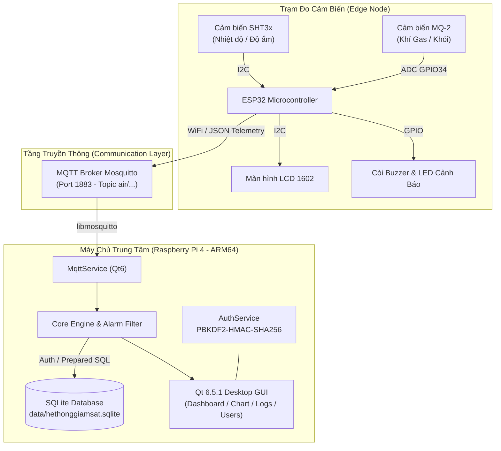

<div align="center">

# 🌿 HỆ THỐNG GIÁM SÁT CHẤT LƯỢNG KHÔNG KHÍ & CẢNH BÁO KHÍ GAS
### Real-Time Air Quality & Gas Monitoring System

[](https://github.com/blynkapp04-ui/Hethonggiamsat/actions/workflows/ci.yml)
[](https://github.com/blynkapp04-ui/Hethonggiamsat/releases)
[](LICENSE)
[](https://en.cppreference.com/w/cpp/17)
[](https://www.qt.io/)
[](https://www.raspberrypi.com/)
[](https://mosquitto.org/)
[](https://www.sqlite.org/)

<p align="center">
  <b>Hệ thống giám sát chất lượng không khí, nhiệt độ, độ ẩm và nồng độ khí gas công nghiệp thời gian thực</b><br>
  Tích hợp trạm đo biên ESP32, truyền thông bảo mật MQTT Mosquitto, máy chủ trung tâm Raspberry Pi 4 chạy ứng dụng Qt 6 GUI hiện đại và cơ sở dữ liệu SQLite3.
</p>

[Tính Năng](#-tính-năng-nổi-bật) •
[Kiến Trúc](#-kiến-trúc-hệ-thống) •
[Phần Cứng](#-phần-cứng--sơ-đồ-chân) •
[Cài Đặt & Chạy](#-hướng-dẫn-cài-đặt--vận-hành) •
[Tài Liệu Kỹ Thuật](#-tài-liệu-kỹ-thuật-chi-tiết) •
[Đóng Góp](#-đóng-góp)

---

</div>

## 🌟 Tính Năng Nổi Bật

- 📊 **Dashboard Thời Gian Thực**: Đồng hồ đo trực quan, biểu đồ thời gian thực duy trì 300 mẫu gần nhất của Nhiệt độ (°C), Độ ẩm (%RH) và Nồng độ khí gas (ADC).
- 🚨 **Cơ Chế Cảnh Báo Kép (Local & Central Alarms)**:
  - **Tại trạm đo ESP32**: Cảnh báo tức thì bằng còi Buzzer & đèn LED trạng thái khi vượt ngưỡng, không phụ thuộc vào kết nối mạng.
  - **Tại trung tâm Raspberry Pi**: Bộ lọc chống rung tín hiệu (Hysteresis 50 ADC, 5 chu kỳ ổn định) chuyển đổi trạng thái `ACTIVE` / `ENDED`.
- ⏱️ **Giám Sát Mất Tín Hiệu (Watchdog Timer)**: Tự động phát hiện và cảnh báo trạng thái `DATA STALE` sau 8 giây không nhận được telemetry từ cảm biến.
- 🔐 **Bảo Mật Đa Cấp Phân Quyền**:
  - Mã hóa mật khẩu người dùng theo chuẩn công nghiệp **PBKDF2-HMAC-SHA256** (120.000 vòng lặp kèm salt ngẫu nhiên).
  - Tự động sinh mật khẩu ngẫu nhiên cho tài khoản `admin` lần đầu tại `data/initial_admin.txt` (permission `0600`).
  - Phân quyền nghiêm ngặt giữa vai trò `ADMIN` (cấu hình ngưỡng, quản lý người dùng) và `USER` (chỉ xem dashboard và lịch sử).
- 💾 **Lưu Trữ & Xuất Dữ Liệu**:
  - Cơ sở dữ liệu SQLite3 giao tác an toàn (Transaction & Prepared Statements chống SQL Injection).
  - Giới hạn tần suất ghi tối ưu I/O thẻ nhớ SD trên Raspberry Pi.
  - Xuất dữ liệu báo cáo lịch sử đo và nhật ký cảnh báo ra file `.csv`.
- 🛠️ **Kiểm Thử Tự Động Tích Hợp Sẵn**: Hỗ trợ `--self-test`, `--mqtt-test` và `--integration-test` chạy ở chế độ offscreen.

---

## 🏗️ Kiến Trúc Hệ Thống



---

## 🔌 Phần Cứng & Sơ Đồ Chân

Chi tiết danh mục linh kiện và sơ đồ đấu nối: Xem thêm tại [HARDWARE.md](HARDWARE.md).

| Linh Kiện | Giao Tiếp | Chân ESP32 (DevKit) | Chức Năng |
| :--- | :--- | :--- | :--- |
| **SHT3x** | I2C (0x44) | SDA: `GPIO 21`, SCL: `GPIO 22` | Đo nhiệt độ & độ ẩm chính xác cao |
| **LCD 1602 I2C** | I2C (0x27) | SDA: `GPIO 21`, SCL: `GPIO 22` | Hiển thị thông số tại hiện trường |
| **MQ-2** | Analog (AO) | `GPIO 34` (ADC1_CH6) | Đo nồng độ khí gas / khói |
| **Active Buzzer** | Digital OUT | `GPIO 25` | Phát âm thanh cảnh báo vượt ngưỡng |
| **LED Đỏ (Cảnh Báo)**| Digital OUT | `GPIO 26` | Đèn đỏ nhấp nháy khi có sự cố |
| **LED Xanh (Trạng Thái)**| Digital OUT | `GPIO 27` | Đèn xanh báo hệ thống sẵn sàng |

---

## 🚀 Hướng Dẫn Cài Đặt & Vận Hành

### 1. Yêu Cầu Môi Trường (Prerequisites)

- **Raspberry Pi 4 Model B** chạy hệ điều hành Raspberry Pi OS (Debian 12 Bookworm 64-bit).
- **Qt 6.5.1** cài đặt tại `/usr/local/qt6`.
- **Mosquitto MQTT Broker** (`sudo apt install mosquitto mosquitto-clients`).
- **CMake 3.18+**, **Ninja**, **GCC/G++ 12+**.
- **PlatformIO Core / VSCode** để nạp firmware ESP32.

---

### 2. Build & Triển Khai Ứng Dụng Qt (Raspberry Pi 4)

#### A. Cross-Compile từ máy Host hoặc Build trực tiếp trên Raspberry Pi:
```bash
cd /home/pi/Duy/Hethonggiamsat

# Cross-build cho ARM64
./scripts/build_arm64.sh

# Deploy sang Raspberry Pi qua SSH
./scripts/deploy_pi.sh
```

#### B. Khởi chạy ứng dụng với giao diện đồ họa:
```bash
ssh pi@192.168.137.227
cd /home/pi/Duy/Hethonggiamsat
LD_LIBRARY_PATH=/usr/local/qt6/lib QT_PLUGIN_PATH=/usr/local/qt6/plugins DISPLAY=:0 ./Hethonggiamsat
```

#### C. Chạy Kiểm Thử Tự Động (Self-test offscreen):
```bash
# Kiểm tra toàn diện các module chức năng
QT_QPA_PLATFORM=offscreen LD_LIBRARY_PATH=/usr/local/qt6/lib \
QT_PLUGIN_PATH=/usr/local/qt6/plugins ./Hethonggiamsat --self-test

# Kiểm tra kết nối và subscribe/publish MQTT broker
QT_QPA_PLATFORM=offscreen LD_LIBRARY_PATH=/usr/local/qt6/lib \
QT_PLUGIN_PATH=/usr/local/qt6/plugins ./Hethonggiamsat --mqtt-test

# Chạy integration test trong 10 giây
QT_QPA_PLATFORM=offscreen LD_LIBRARY_PATH=/usr/local/qt6/lib \
QT_PLUGIN_PATH=/usr/local/qt6/plugins ./Hethonggiamsat --integration-test
```

---

### 3. Nạp Firmware Cho ESP32 (PlatformIO)

1. Sao chép file cấu hình bảo mật:
   ```bash
   cp esp32/include/secrets.h.example esp32/include/secrets.h
   ```
2. Điền thông tin WiFi (`WIFI_SSID`, `WIFI_PASSWORD`) và thông tin tài khoản MQTT.
3. Build và nạp firmware:
   ```bash
   cd esp32
   # Trên Linux/macOS
   pio run --target upload
   
   # Hoặc trên Windows
   UPLOAD_ESP32.bat
   ```

---

## 📚 Tài Liệu Kỹ Thuật Chi Tiết

Mọi khía cạnh kiến trúc và vận hành đều được lập tài liệu kỹ thuật đầy đủ:

- 🏛️ [ARCHITECTURE.md](ARCHITECTURE.md): Kiến trúc phân tầng, luồng xử lý và cơ chế an toàn.
- 🔌 [HARDWARE.md](HARDWARE.md): Bảng thông số linh kiện, sơ đồ nguyên lý và lưu ý nguồn điện.
- 📡 [MQTT_TOPICS.md](MQTT_TOPICS.md): Cấu trúc JSON payload và định danh topic MQTT.
- 🗄️ [DATABASE_SCHEMA.md](DATABASE_SCHEMA.md): Cấu trúc bảng SQLite, index và các trigger toàn vẹn.
- 🚀 [DEPLOYMENT.md](DEPLOYMENT.md): Hướng dẫn thiết lập Kit Qt Creator, build script và service.
- 🧪 [TEST_REPORT.md](TEST_REPORT.md): Nhật ký kiểm thử, kết quả đo hiệu năng và độ ổn định.

---

## 📁 Cấu Trúc Mã Nguồn (Repository Layout)

```text
.
├── .github/                      # Cấu hình GitHub Actions, Issue & PR Templates
│   ├── workflows/
│   │   ├── ci.yml                # CI build tự động cho Qt và ESP32
│   │   └── release.yml           # Tự động xuất bản GitHub Release
│   ├── ISSUE_TEMPLATE/           # Biểu mẫu báo lỗi và đề xuất tính năng
│   ├── PULL_REQUEST_TEMPLATE.md  # Quy chuẩn gửi Pull Request
│   └── dependabot.yml            # Tự động cập nhật dependencies
├── data/                         # Thư mục chứa cơ sở dữ liệu SQLite runtime
├── esp32/                        # Mã nguồn Firmware PlatformIO cho ESP32
│   ├── include/                  # Header files (config, secrets, sensors)
│   ├── src/                      # C++ source files (MQTT, LCD, WiFi, Sensors)
│   └── platformio.ini            # Cấu hình môi trường build PlatformIO
├── include/                      # C++ Header files ứng dụng Qt trung tâm
├── logs/                         # Thư mục chứa nhật ký hoạt động hệ thống
├── scripts/                      # Shell scripts tự động hóa build, deploy và run
├── src/                          # C++ Source files ứng dụng Qt trung tâm
├── ui/                           # Giao diện người dùng Qt Widgets & Pages
├── .clang-format                 # Quy chuẩn định dạng C++17
├── .editorconfig                 # Quy chuẩn editor đồng bộ
├── .gitignore                    # Cấu hình loại trừ file rác và artifacts
├── .gitattributes                # Chuẩn hóa định dạng xuống dòng (LF/CRLF)
├── CHANGELOG.md                  # Nhật ký các phiên bản phát hành
├── CODE_OF_CONDUCT.md            # Bộ quy tắc ứng xử cộng đồng
├── CONTRIBUTING.md               # Hướng dẫn quy trình đóng góp mã nguồn
├── LICENSE                       # Giấy phép nguồn mở MIT
├── README.md                     # Tài liệu giới thiệu chính của dự án
└── SECURITY.md                   # Chính sách bảo mật và báo cáo lỗ hổng
```

---

## 🤝 Đóng Góp (Contributing)

Mọi đóng góp nhằm cải thiện hệ thống đều được hoan nghênh! Vui lòng đọc kỹ [CONTRIBUTING.md](CONTRIBUTING.md) và [CODE_OF_CONDUCT.md](CODE_OF_CONDUCT.md) trước khi tạo Pull Request.

---

## 📜 Giấy Phép (License)

Dự án được phân phối dưới giấy phép mã nguồn mở **MIT License**. Chi tiết xem tại [LICENSE](LICENSE).
