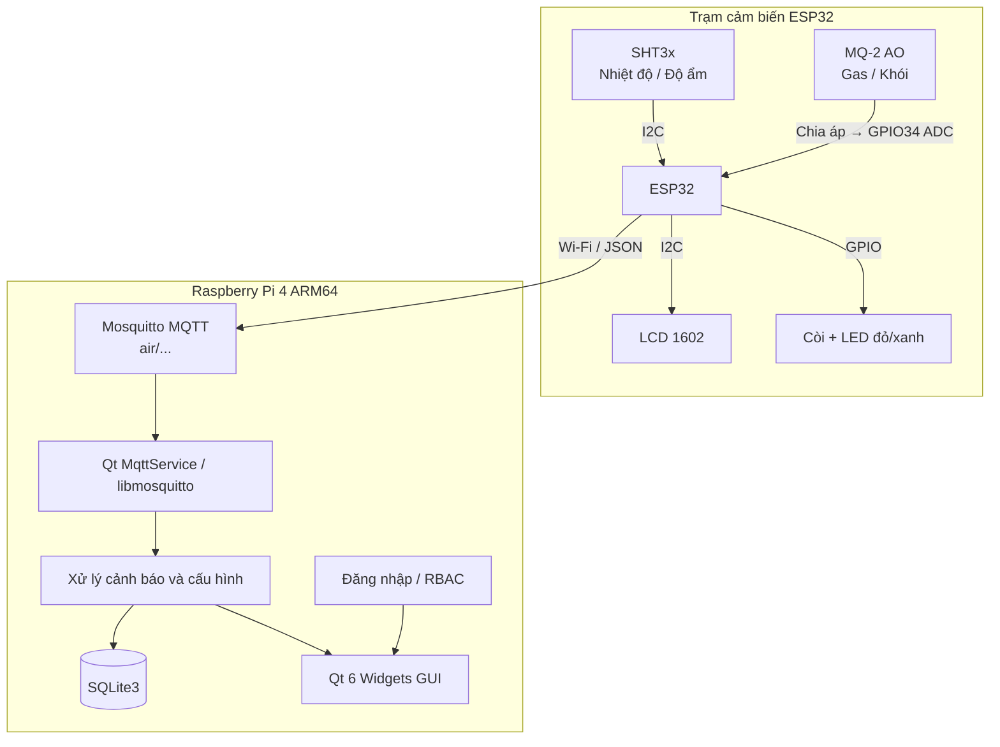

<div align="center">

# 🌿 HỆ THỐNG GIÁM SÁT CHẤT LƯỢNG KHÔNG KHÍ
### Real-Time Air Quality Monitoring & Multi-Sensor Alarm System

[](https://github.com/dtc225030017-lang/Hethonggiamsat/actions/workflows/ci.yml)
[](LICENSE)
[](https://en.cppreference.com/w/cpp/17)
[](https://www.qt.io/)
[](https://www.raspberrypi.com/)
[](https://mosquitto.org/)
[](https://www.sqlite.org/)

<p align="center">
  <b>Giám sát nhiệt độ, độ ẩm và khí gas/khói theo thời gian thực</b><br>
  ESP32 thu thập dữ liệu và cảnh báo tại chỗ; Raspberry Pi 4 chạy ứng dụng Qt 6,
  MQTT Mosquitto và SQLite để hiển thị, cấu hình và lưu lịch sử.
</p>

[Tính Năng](#-tính-năng-nổi-bật) •
[Kiến Trúc](#-kiến-trúc-hệ-thống) •
[Phần Cứng](#-phần-cứng--sơ-đồ-chân) •
[Cài Đặt & Chạy](#-hướng-dẫn-cài-đặt--vận-hành) •
[Cấu Trúc](#-cấu-trúc-mã-nguồn-repository-layout)

---

</div>

## 🌟 Tính Năng Nổi Bật

- 📊 **Dashboard thời gian thực**:
  - Hiển thị nhiệt độ, độ ẩm, MQ-2 theo đơn vị ADC và mV.
  - Ba biểu đồ giữ tối đa 300 mẫu gần nhất.
  - Hiển thị trạng thái ESP32, MQTT và thời điểm nhận dữ liệu cuối.
- 🚨 **Bốn loại cảnh báo độc lập**:
  - `MQ2_HIGH`: khí gas/khói vượt ngưỡng ADC.
  - `TEMP_HIGH`: nhiệt độ vượt ngưỡng cao.
  - `HUMIDITY_HIGH`: độ ẩm vượt ngưỡng cao.
  - `HUMIDITY_LOW`: độ ẩm xuống dưới ngưỡng thấp.
- 🔔 **Cảnh báo tại ESP32**:
  - Khi có bất kỳ cảnh báo nào: bật còi, bật LED đỏ và tắt LED xanh.
  - Khi mọi thông số an toàn liên tục 3 giây: tắt còi/LED đỏ và bật LED xanh.
  - Hoạt động tại chỗ ngay cả khi Wi-Fi hoặc MQTT bị mất kết nối.
  - Thứ tự ưu tiên: MQ-2 → nhiệt độ cao → độ ẩm cao → độ ẩm thấp.
- 🎚️ **Cấu hình từ ứng dụng**:
  - Ngưỡng mặc định: MQ-2 `2500 ADC`, nhiệt độ `50 °C`, độ ẩm cao `90%`, độ ẩm thấp `20%`.
  - ADMIN có thể chỉnh ngưỡng và gửi xuống ESP32 qua MQTT.
- 🧪 **MQ-2 chống nhiễu**:
  - Đọc chân AO trên GPIO34 với độ phân giải ADC 12-bit.
  - Mỗi chu kỳ lấy trung bình 30 mẫu, cách nhau 5 ms.
  - Cập nhật cảm biến và telemetry mỗi 1 giây.
- ⏱️ **Watchdog dữ liệu**: báo `DỮ LIỆU QUÁ HẠN` sau 8 giây không nhận telemetry.
- 🔐 **Tài khoản và phân quyền**:
  - Mật khẩu được băm bằng PBKDF2-HMAC-SHA256 với salt ngẫu nhiên.
  - `ADMIN` được cấu hình hệ thống và quản lý tài khoản; `USER` chỉ xem dữ liệu.
  - Có nút **Đăng xuất** để kết thúc phiên và quay lại màn hình đăng nhập.
- 💾 **SQLite và CSV**: lưu dữ liệu đo, trạng thái, lịch sử cảnh báo và hỗ trợ xuất CSV.
- 🛠️ **Kiểm thử tích hợp**: hỗ trợ `--self-test`, `--mqtt-test` và `--integration-test`.

---

## 🏗️ Kiến Trúc Hệ Thống



Luồng cấu hình đi theo chiều ngược lại: ứng dụng Qt lưu cấu hình, publish các ngưỡng
lên MQTT, ESP32 nhận ngưỡng mới và áp dụng cho cảnh báo tại chỗ.

---

## 🔌 Phần Cứng & Sơ Đồ Chân

| Linh kiện | Giao tiếp | Chân ESP32 | Chức năng |
| :--- | :--- | :--- | :--- |
| **SHT3x** | I2C `0x44` | SDA `GPIO21`, SCL `GPIO22` | Đo nhiệt độ và độ ẩm |
| **LCD 1602 I2C** | I2C `0x27` | SDA `GPIO21`, SCL `GPIO22` | Hiển thị số đo/cảnh báo tại chỗ |
| **MQ-2** | Analog `AO` | `GPIO34` (`ADC1_CH6`) | Đo mức khí gas/khói |
| **Active Buzzer** | Digital OUT | `GPIO25` | Âm thanh cảnh báo |
| **LED xanh** | Digital OUT | `GPIO26` | Hệ thống bình thường |
| **LED đỏ** | Digital OUT | `GPIO27` | Hệ thống đang cảnh báo |

### Đấu MQ-2 an toàn

MQ-2 được cấp `5V`, nhưng GPIO ESP32 chỉ chịu mức điện áp khoảng `3.3V`. Không nối
AO trực tiếp vào GPIO34. Dùng bộ chia áp và nối chung GND:

```text
MQ-2 AO ── 10kΩ ──●──── GPIO34 ESP32
                   │
                  20kΩ
                   │
MQ-2 GND ──────────┴──── GND ESP32
```

- MQ-2 `VCC` → nguồn `5V` ổn định.
- MQ-2 `GND` → GND ESP32.
- MQ-2 `AO` → điện trở `10kΩ` → điểm giữa `●`.
- Điểm giữa `●` → GPIO34 và điện trở `20kΩ` xuống GND.
- Chân `DO` không được firmware hiện tại sử dụng.

---

## 🚀 Hướng Dẫn Cài Đặt & Vận Hành

### 1. Môi Trường Hiện Tại

| Thành phần | Giá trị |
| :--- | :--- |
| Source host Ubuntu VM | `/home/pi/Duy/Hethonggiamsat` |
| Source ESP32 Windows | `C:\Users\admin\Documents\PlatformIO\Projects\Hethonggiamsat-esp32` |
| Raspberry Pi đích | `pi@192.168.137.227` |
| Thư mục chạy trên Pi | `/home/pi/Duy/Hethonggiamsat` |
| Qt runtime trên Pi | `/usr/local/qt6` |
| Cổng MQTT mặc định | `1883` |

Yêu cầu host: CMake 3.18+, Ninja, bộ cross-toolchain ARM64/Qt 6.5.1 và SSH key
truy cập Pi. ESP32 được build/nạp bằng PlatformIO trên **Windows**, không nạp từ
Ubuntu VM.

### 2. Build, Deploy và Run Host bằng Qt Creator

Mở `CMakeLists.txt` bằng Qt Creator và chọn kit:

```text
Hethonggiamsat - Raspberry Pi 4 ARM64
```

Sau đó chỉ cần bấm **Run**. Cấu hình hiện tại thực hiện tự động:

```text
Cross-build ARM64
        ↓
Deploy binary qua SSH tới Raspberry Pi thật
        ↓
Dừng instance cũ và chạy giao diện mới trên DISPLAY=:0 của Pi
```

Các script Qt Creator sử dụng:

- `scripts/qtcreator_build_deploy.sh`: gọi cross-build và deploy.
- `scripts/build_arm64.sh`: tạo binary ARM64 trong `build-arm64-qtcreator/`.
- `scripts/deploy_pi.sh`: chép binary tới Pi qua SSH.
- `scripts/run_from_qtcreator.sh`: chạy ứng dụng trên màn hình Pi thật.

ESP32 không nằm trong Build Step này. Firmware được nạp riêng trên Windows.

### 3. Build/Deploy Host bằng Terminal

```bash
cd /home/pi/Duy/Hethonggiamsat

# Cross-build và deploy
./scripts/qtcreator_build_deploy.sh

# Hoặc build, deploy và yêu cầu chạy dạng nền
./scripts/build_deploy_run.sh
```

Chạy trực tiếp trên Pi khi cần kiểm tra thủ công:

```bash
cd /home/pi/Duy/Hethonggiamsat
DISPLAY=:0 \
LD_LIBRARY_PATH=/usr/local/qt6/lib \
QT_PLUGIN_PATH=/usr/local/qt6/plugins \
./Hethonggiamsat
```

### 4. Nạp Firmware ESP32 trên Windows

Mở project:

```text
C:\Users\admin\Documents\PlatformIO\Projects\Hethonggiamsat-esp32
```

1. Kiểm tra `include/secrets.h` có đúng Wi-Fi và tài khoản MQTT.
2. Kết nối ESP32 vào Windows hoặc chọn **Connect to host** trong VMware.
3. Trong PlatformIO chọn đúng cổng COM.
4. Bấm **Upload**, hoặc chạy `UPLOAD_ESP32.bat` trong thư mục project.
5. Mở Serial Monitor ở `115200 baud` để kiểm tra log.

Firmware đã có đầy đủ cảnh báo MQ-2, nhiệt độ cao, độ ẩm cao và độ ẩm thấp.

### 5. Cấu Hình Ngưỡng Trên Giao Diện

Đăng nhập bằng tài khoản `ADMIN`, mở tab **Cài đặt**, nhập:

- Ngưỡng MQ-2: `1–4095 ADC`.
- Nhiệt độ cao: `-20–100 °C`.
- Độ ẩm cao: `0–100%`.
- Độ ẩm thấp: `0–100%` và phải nhỏ hơn ngưỡng độ ẩm cao.
- Chu kỳ lưu database: `1–3600 giây`.

Bấm **Lưu và gửi xuống ESP32**. Ứng dụng lưu cấu hình vào SQLite và publish:

```text
air/config/mq2_ao_threshold
air/config/temp_high
air/config/humidity_high
air/config/humidity_low
```

### 6. Kiểm Thử Host Trên Raspberry Pi

```bash
cd /home/pi/Duy/Hethonggiamsat

QT_QPA_PLATFORM=offscreen \
LD_LIBRARY_PATH=/usr/local/qt6/lib \
QT_PLUGIN_PATH=/usr/local/qt6/plugins \
./Hethonggiamsat --self-test
```

Các chế độ bổ sung:

```bash
./Hethonggiamsat --mqtt-test
./Hethonggiamsat --integration-test
```

Khi chạy hai lệnh này trên Pi, cũng cần đặt `LD_LIBRARY_PATH` và `QT_PLUGIN_PATH`
như lệnh self-test phía trên.

---

## 📚 Tài Liệu Kỹ Thuật Chi Tiết

README này là tài liệu vận hành chính và được cập nhật theo hệ thống hiện tại.
Những nguồn cấu hình quan trọng:

- `CMakeLists.txt`: target Qt 6.5/C++17 và các thư viện liên kết.
- `CMakeLists.txt.user`: kit, Build Step và Run Configuration của Qt Creator trên máy hiện tại.
- `esp32/platformio.ini`: board, framework và thư viện firmware.
- `esp32/include/config.h`: chân GPIO, chu kỳ lấy mẫu và ngưỡng mặc định.
- `esp32/include/secrets.h.example`: mẫu cấu hình Wi-Fi/MQTT; không chứa mật khẩu thật.
- `.github/workflows/ci.yml`: quy trình build/kiểm tra CI.

Không commit hoặc chia sẻ `esp32/include/secrets.h`, database runtime, log hay file
`data/initial_admin.txt`.

---

## 📁 Cấu Trúc Mã Nguồn (Repository Layout)

Thư mục gốc của dự án trên Ubuntu VM:

```text
/home/pi/Duy/Hethonggiamsat
```

### Cây thư mục chi tiết

```text
.
├── .github/                                  # Tự động hóa và biểu mẫu GitHub
│   ├── ISSUE_TEMPLATE/
│   │   ├── bug_report.yml                    # Mẫu báo cáo lỗi
│   │   ├── config.yml                        # Cấu hình trang tạo issue
│   │   └── feature_request.yml               # Mẫu đề xuất tính năng
│   ├── workflows/
│   │   ├── ci.yml                            # Build/kiểm tra host và firmware trên CI
│   │   └── release.yml                       # Đóng gói bản phát hành
│   ├── dependabot.yml                        # Theo dõi cập nhật dependency
│   └── PULL_REQUEST_TEMPLATE.md              # Checklist Pull Request
│
├── esp32/                                    # Firmware ESP32 đi kèm source host
│   ├── include/                              # Khai báo module firmware
│   │   ├── alarm_service.h                   # Máy trạng thái còi và LED
│   │   ├── config.h                          # GPIO, chu kỳ và ngưỡng mặc định
│   │   ├── lcd_display.h                     # Giao diện điều khiển LCD 1602
│   │   ├── mq2_sensor.h                      # Kết quả đọc MQ-2 AO
│   │   ├── mqtt_service.h                    # MQTT và getter các ngưỡng
│   │   ├── network_settings.h                # API cấu hình Wi-Fi/MQTT
│   │   ├── secrets.h.example                 # Mẫu thông tin Wi-Fi/MQTT
│   │   ├── secrets.h                         # Bí mật thật, bị .gitignore loại trừ
│   │   ├── sht3x_sensor.h                    # API cảm biến SHT3x
│   │   ├── system_state.h                    # Dữ liệu hệ thống và AlarmKind
│   │   └── wifi_service.h                    # API quản lý Wi-Fi
│   ├── src/                                  # Hiện thực firmware
│   │   ├── alarm_service.cpp                 # Bật cảnh báo, tắt trễ sau 3 giây an toàn
│   │   ├── lcd_display.cpp                   # Hiển thị số đo/nguyên nhân cảnh báo
│   │   ├── main.cpp                          # setup, loop và ưu tiên bốn cảnh báo
│   │   ├── mq2_sensor.cpp                    # ADC 12-bit, trung bình 30 mẫu MQ-2
│   │   ├── mqtt_service.cpp                  # Telemetry, config và lệnh buzzer
│   │   ├── network_settings.cpp              # Wi-Fi/MQTT từ secrets hoặc WiFiManager
│   │   ├── sht3x_sensor.cpp                  # Đọc nhiệt độ/độ ẩm
│   │   └── wifi_service.cpp                  # Kết nối và tự phục hồi Wi-Fi
│   ├── lib/README                            # Vị trí thư viện PlatformIO nội bộ nếu có
│   ├── test/README                           # Vị trí test firmware nếu bổ sung
│   ├── .vscode/                              # Gợi ý PlatformIO/VS Code
│   ├── .gitignore                            # Loại cache và secrets firmware
│   ├── platformio.ini                        # Board esp32dev, framework và lib_deps
│   └── UPLOAD_ESP32.bat                      # Build/nạp trên Windows
│
├── include/                                  # Header của ứng dụng Qt trên Raspberry Pi
│   ├── alarm_service.h                       # API lưu và kết thúc cảnh báo SQLite
│   ├── app_config.h                          # Tên app, đường dẫn, watchdog, số điểm chart
│   ├── app_logger.h                          # API log ứng dụng
│   ├── auth_service.h                        # Xác thực và quản trị tài khoản
│   ├── csv_exporter.h                        # Xuất dữ liệu CSV
│   ├── database_manager.h                    # Kết nối, schema và cấu hình SQLite
│   ├── models.h                              # SensorReading, AppSettings, UserSession
│   ├── mq2_filter.h                          # Bộ lọc MQ-2 dùng trong kiểm thử/tương thích
│   ├── mqtt_service.h                        # MQTT Qt signals/slots
│   ├── sensor_repository.h                   # Lưu và truy vấn telemetry
│   └── settings_service.h                    # Đọc/ghi ngưỡng và cấu hình MQTT
│
├── src/                                      # Hiện thực phần lõi ứng dụng Qt
│   ├── alarm_service.cpp                     # Lịch sử bốn loại cảnh báo
│   ├── app_logger.cpp                        # Log có timestamp ra console/file
│   ├── auth_service.cpp                      # PBKDF2 và phân quyền ADMIN/USER
│   ├── csv_exporter.cpp                      # Tạo báo cáo CSV
│   ├── database_manager.cpp                  # Khởi tạo/migration database
│   ├── main.cpp                              # QApplication, test và vòng đăng nhập/đăng xuất
│   ├── mq2_filter.cpp                        # Median/EMA/hysteresis MQ-2
│   ├── mqtt_service.cpp                      # Parse telemetry và publish ngưỡng
│   ├── sensor_repository.cpp                 # CRUD dữ liệu cảm biến
│   └── settings_service.cpp                  # Lưu cấu hình hệ thống
│
├── ui/                                       # Giao diện Qt Widgets
│   ├── login_window.h/.cpp                   # Màn hình đăng nhập
│   ├── main_window.h/.cpp                    # Tabs, status bar và nút Đăng xuất
│   ├── dashboard_page.h/.cpp                 # Thẻ số đo, trạng thái và ba biểu đồ
│   ├── history_page.h/.cpp                   # Lịch sử telemetry và xuất CSV
│   ├── alarm_history_page.h/.cpp             # Lịch sử cảnh báo ACTIVE/ENDED
│   ├── settings_page.h/.cpp                  # Ngưỡng và MQTT dành cho ADMIN
│   └── users_page.h/.cpp                     # Quản lý tài khoản dành cho ADMIN
│
├── scripts/                                  # Build, deploy và vận hành
│   ├── build_arm64.sh                        # Cross-build Qt/C++ cho ARM64
│   ├── deploy_pi.sh                          # Dừng bản cũ và chép binary sang Pi
│   ├── build_deploy_run.sh                   # Build + deploy + chạy nền
│   ├── configure_qtcreator.sh                # Hỗ trợ cấu hình kit Qt Creator
│   ├── qtcreator_build_deploy.sh             # Build Step khi bấm Run
│   ├── run_from_qtcreator.sh                 # Run Configuration chạy trên Pi
│   └── git_sync_github.sh                    # Tiện ích đồng bộ GitHub
│
├── data/                                     # Database và bí mật runtime trên host
│   ├── .gitkeep                              # Giữ thư mục trong Git
│   ├── hethonggiamsat.sqlite                 # Tạo khi chạy, không commit
│   ├── initial_admin.txt                     # Tạo lần đầu, mode 0600, không commit
│   └── mqtt_credentials.ini                  # Tạo khi lưu MQTT, không commit
├── logs/                                     # Nhật ký runtime, không commit
│   └── .gitkeep                              # Giữ thư mục trong Git
├── build-arm64-qtcreator/                    # Kết quả cross-build ARM64, sinh tự động
├── build-host-qt65/                          # Kết quả build/test x86_64, sinh tự động
│
├── .clang-format                             # Quy tắc định dạng C++
├── .editorconfig                             # Quy tắc editor chung
├── .gitattributes                            # Thuộc tính file Git
├── .gitignore                                # Loại build, secrets, DB và log
├── CMakeLists.txt                            # Target Qt 6.5, C++17, SQLite, libmosquitto
├── CMakeLists.txt.user                       # Kit/Build/Run của Qt Creator trên Ubuntu VM này
├── LICENSE                                   # MIT License
└── README.md                                 # Tài liệu vận hành chính
```
